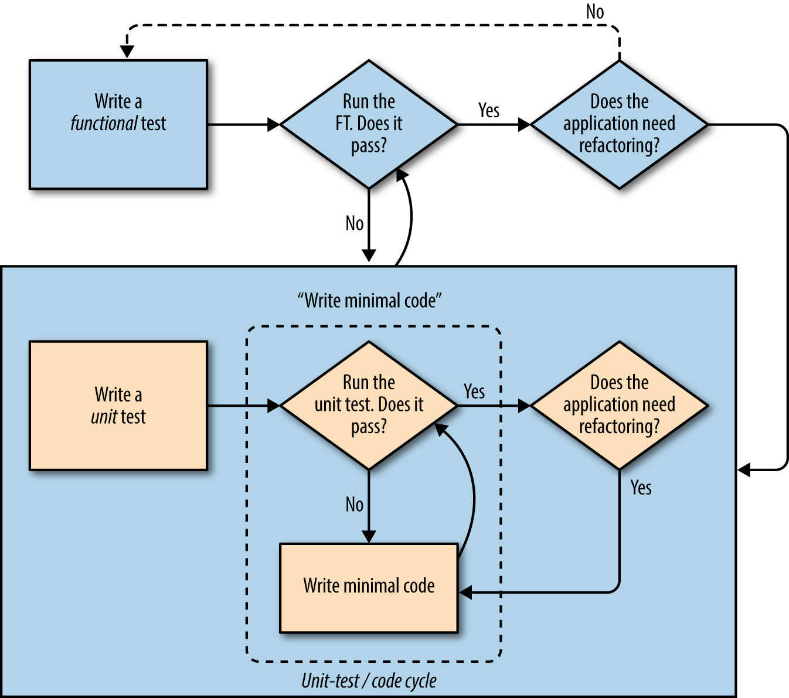

# Obey the Testing Goat

This repo contains my code and (rough) notes from working through the excellent [Obey the Testing Goat book](https://www.obeythetestinggoat.com/) on Test-Driven Development with Python.

## Dependencies

Install [geckodriver](https://github.com/mozilla/geckodriver/releases), which is a proxy that allows us to control Firefox programmatically via Selenium. Confirm installation:

```
geckodriver --version
```

Create a Python virtual environment, which enables us to configure & install a specific Python version and modules for the project directory:

```
python3.6 -m venv virtualenv
```

The `-m` flag tells Python to run the `venv` module directly (rather than as an imported library), and `virtualenv` is the directory name for the virtual environment files.

Activate the virtual environment:

```
source virtualenv/bin/activate
# deactivate with "deactivate"
```

Install Django and Selenium in the virtual environment:

```
pip install "django<1.12" "selenium<4"
```

[Django](https://www.djangoproject.com/) is a Python web framework. [Selenium](https://www.seleniumhq.org/) is many things, but practically speaking, it's a library for driving web browsers.

## Chapter 1 - getting started

### Philosophy and first test

Looks like the basic Test Driven Development (TDD) philosophy is to always start with a test, which makes sense...

General process
1. write a test for what I want to do
2. run it and confirm that if fails as expected (this is important because it provides some confidence that we wrote the test correctly)
3. *then* write application code to do the thing I want

and along the way being sure to take small modular steps, so things never get out of hand.

Start at the very beginning, even before setting up the framework boilerplate configuration. Start with a functional test to spin up a browser instance using selenium, and check that Django is installed and that the dev server runs. For example:

    # functional_test.py

    from selenium import webdriver

    browser = webdriver.Firefox()
    browser.get('http://localhost:8000')

    assert 'Django' in browser.title

We run the test (`python functional_test.py`) and get the expected failure "Unable to connect", which means we can start writing application code.

Selenium also has a ton of useful methods like:
* `find_element_by_id` - find an element on the page
* `send_keys` - type in input elements
* etc.

### Configuring Django boilerplate

Create a Django "project", which represents the top level collection of files for our application:

    django-admin.py startproject superlists .

This creates the Django boilerplate files & directory structure, along with the manage.py file that we use to do Django stuff. For example, starting Django's dev server:

    python manage.py runserver

Which allows the first test to pass.

The following Django + selenium files can be git ignored (added to `.gitignore`):
* `db.sqlite3` - the file that represents the default sqlite database
* `geckodriver.log` - probably a log for selenium driver errors
* `virtualenv` - the Python virtual environment config files
* `__pycache__` - probably some kind of Python runtime cache
* `*.pyc`- probably some kind of Python runtime cache
* `/static` - from Ch8, copies of static files for serving in production


## Chapter 2 - more philosophy & Python's unittest

### Functional tests and user stories

What are "functional" (FT) tests?

> Tests that use Selenium let us drive a real web browser, so they really let us see how the application functions from the user’s point of view. That’s why they’re called functional tests.

> This means that an FT can be a sort of specification for your application. It tends to track what you might call a User Story, and follows how the user might work with a particular feature and how the app should respond to them.

FT's are AKA Acceptance tests, end-to-end tests, and black box tests.

Expanding the TDD philosophy:
1. start development by using comments to create a "User Story" for a Minimum Viable Product (MVP) - the simplest app that is useful.
2. create functional tests to basically follow the user story. So for example:

```
from selenium import webdriver

browser = webdriver.Firefox()

# Edith has heard about a cool new online to-do app. She goes
# to check out its homepage
browser.get('http://localhost:8000')

# She notices the page title and header mention to-do lists
assert 'To-Do' in browser.title

...
```

Comments make up the user story, and selenium is used to simulate a user.

### A comment on comments

Comments should typically be used to describe *why* some code does something, rather than what the code does, particularly when the code's purpose is not obvious. For example:

    ## We use a new browser session to make sure that no information
    ## of Edith's is coming from cookies, etc.
    self.browser.quit()

Where it's not obvious why you're quitting the browser instance. Or the classic:

    # dont change this because everything breaks and we dont know why

But in in general your code itself should describe *what* is happening. This should be communicated with variable and function names, code structure, etc. Because reading code is really important and writing readable code is almost never worse performing, so you might as well write it well.

Additionally comments are annoying to maintain, because they need to always be updated with the code and will eventually become out of sync. It's subjective, but sometimes it makes more sense even to write code that is less concise if it's more readable, in my opinion. For example:

    // Not sure what name really means or how I got it?
    const name = retrieve('/data/users?q=income').people.filter(person => person.age > 100)[0].name;

    // Ah I see
    const usersByIncome = retrieve('/data/users?q=income');
    const centenarianByIncome = usersByIncome.people.filter(person => person.age > 100);
    const highestIncomeCentenarian = centenarianByIncome[0];
    const highestIncomeCentenarianName = highestIncomeCentenarian.name;

### Python Standard Library's unittest Module

There's of course some common patterns that naturally evolve from testing, like logging details of failed tests, setting up and tearing down browser instances, etc. Python's `unittest` module has a lot of this functionality built in. For example, in the following:

    from selenium import webdriver
    import unittest

      class NewVisitorTest(unittest.TestCase):

          def setUp(self):
              self.browser = webdriver.Firefox()

          def tearDown(self):
              self.browser.quit()

          def test_can_start_a_list_and_retrieve_it_later(self):
              # Edith has heard about a cool new online to-do app. She goes
              # to check out its homepage
              self.browser.get('http://localhost:8000')

              # She notices the page title and header mention to-do lists
              self.assertIn('To-Do', self.browser.title)
              self.fail('Finish the test!')

      if __name__ == '__main__':
          unittest.main(warnings='ignore')

* Tests are organize into classes inheriting from `unittest.TestCase`
* Any method whose name starts with "test" will be run by the test runner, which is called with `unittest.main()`
* `setUp` and `tearDown` run before & after each test to ensure each test starts fresh (unaffected by other tests) and browser instances are cleaned up, etc.
* `unittest` provides helper methods like `self.fail`, `self.assertIn`, etc.

Note: Django has it's own test runner and class, which inherits from `unittest`. See chapter 5 & 6 notes.

## Chapter 3 - Django basics and unit tests

### Django basics

Django structures code into "apps", on the assumption that this will make them more modular and reusable. Apps are created with the `manage.py` `startapp` command, e.g.:

    python manage.py startapp lists

which creates a folder for the app with basic boilerplate.

One thing I found interesting is that app folders are on the same level with project folders (so `lists` & `superlists` are siblings), rather than apps living inside projects. Doesn't really matter, just though it was kind of odd since a project is theoretically made up of a collection of apps, and I would expect the app folders to be children in the project folder.

### Unit tests

> functional tests test the application from the outside, from the point of view of the user. Unit tests test the application from the inside, from the point of view of the programmer.

Extending the TDD philosophy again. The new process is:
1. write a functional test, describing the behavior from the users point of view (again, tracking the user story)
2. FT fails expectedly
3. write unit tests that describe how our solution code should behave
4. unit tests fail expectedly
5. write the smallest application code possible to pass the unit test
6. iterate - adding unit tests + application code cycles until the FT passes, and then adding more FT's and repeating.


https://www.obeythetestinggoat.com/book/chapter_philosophy_and_refactoring.html

Why do I need these extra tests?
* FTs ensure that stuff works as user expects and unit tests ensure that internals work as programmers expect.
* Small iterations ensure that as much of the application code as possible is "covered" by the tests (and that we dont sneak in a potential bug somehow by writing a complex method that we might not be testing thoroughly but passes the tests anyways).

> Functional tests should help you build an application with the right functionality, and guarantee you never accidentally break it. Unit tests should help you to write code that’s clean and bug free.

### Django unit test boilerplate

Django has a boilerplate test file:

    from django.test import TestCase

    # Create your tests here.

which imports an extended version of the Python standard library's `unittest.TestCase` with extra features. The tests here can be run with Django's test runner via manage.py:

    python manage.py test

Using Django's test runner enables additional functionality like spinning up test databases.

### Django basics

* Django roughly follows the common MVC pattern
  * has models for sure
  * views are more like the controller
  * templates are really the views
* Django uses request-response pairs like Express.
* Django uses a file called `urls.py` to map URLs to view functions.

There’s a main `urls.py` for the whole site in the the project folder (e.g., `superlists/urls.py`)

So we could do something like this:

    # superlists/urls.py

    from django.conf.urls import url
    from lists import views

    urlpatterns = [
        url(r'^$', views.home_page, name='home'),
    ]

Where

> A url entry starts with a regular expression that defines which URLs it applies to, and goes on to say where it should send those requests — ​either to a view function you’ve imported, or maybe to another urls.py file somewhere else

So in this case the empty string regex `^$` maps to a `home_page` view, which is just a function in the `lists/views.py` file. A simple example might be:

    # lists/views.py

    def home_page(request):
      return HttpResponse('<html><title>To-Do lists</title></html>')

## Chapter 4 - a little more of everything

### A TDD metaphor

* Writing tests can be annoying for simple changes that seem trivial, but the idea is that, generally, complexity sneaks up over time, and you wont always be fresh or remember everything thats going on, and tests serve as a way to sort of save your progress.

* The metaphor is pulling buckets of water from a well - it's easy at first but eventually you get tired and the deeper the water is, the harder the task becomes. Tests serve as a ratchet to ensure that you never slip backwards.

* Writing tests for every single change is tedious, but it's the only way to ensure that your not subjectively trying to guess when something is complex enough to warrant testing, which is a recipe for failure. Additionally, if you're writing tests for trivial changes, the tests themselves should be relatively trivial and thus not too bad to implement.

### More Django basics

#### Templates

Django uses templates like other frameworks. For example:

    # templates/home.html

    <html>
        <title>To-Do lists</title>
    </html>

These represent the views in the MVC pattern. So the previous example view function:

    # lists/views.py

    def home_page(request):
      return HttpResponse('<html><title>To-Do lists</title></html>')

could be replaced with:

    # lists/views.py

    from django.shortcuts import render

    def home_page(request):
        return render(request, 'home.html')

Where `home.html` is a template HTML file. Django automatically looks for files in `templates` directories.

And of course, like other frameworks, it's possible to pass variables into a template and have them render dynamic content. For example:

    <table id="id_list_table">
        <tr><td>{{ new_item_text }}</td></tr>
    </table>

#### Registering apps

One unintuitive gotcha (at least for me) with Django is that you have to register your apps, by adding the app to the `INSTALLED_APPS` variable in the `settings.py` file. I'm not sure why creating the app initially with `startapp` doesn't automatically do this.

#### Test client

Django has a [test client](https://docs.djangoproject.com/en/1.11/topics/testing/tools/#the-test-client) which acts like a dummy web browser, a little like selenium. But unlike selenium it's better suited for things like establishing that the correct template is being used in the correct context, and less suited for inspecting rendered HTML or webpage behavior. So it's good for some unit tests but the FTs should stick with selenium. Example unit test:

    def test_home_page_returns_correct_html(self):
        response = self.client.get('/')
        self.assertTemplateUsed(response, 'home.html')

Here the testing `client` gets a url, and asserts that the correct template was used.

#### TDD and refactoring

TDD is super nice for refactoring because you can ensure that nothing was broken during the changes.

> When refactoring, work on either the code or the tests, but not both at once.

This is definitely a mistake I've made myself in the past, where I start out refactoring something, and then along the way I just group in some small changes I wanted to make, and then something somewhere else breaks so I just fix that real quick, but that breaks something else, and then I have multiple changes and at least one bug and it's all mixed in with the refactor. Best to do it slowly piece by piece.

## Chapter 5 - more fundamentals, databases, & object relational mapping

### CSRF and dynamic templating

Handling CSRF tokens is pretty convenient in Django. All thats required is a "template tag":

    <form method="POST">
        <input name="item_text" id="id_new_item" placeholder="Enter a to-do item" />
        
    </form>

And the framework automatically inserts the appropriate token in a `<input type="hidden">`, and handles subsequent validation. And the dev server even catches forms without CSRF tokens during development! Pretty nice.

Similarly, Django allows dynamic rendering with template syntax like you would expect:

    <body>
        <h1>Your To-Do list</h1>
        <form method="POST">
            <input name="item_text" id="id_new_item" placeholder="Enter a to-do item" />
            
        </form>

        <table id="id_list_table">
            <tr><td>{{ new_item_text }}</td></tr>
        </table>
    </body>

    def home_page(request):
    return render(request, 'home.html', {
        'new_item_text': request.POST['item_text'],
    })

or

    <table id="id_list_table">
        
            <tr><td>{{ item.text }}</td></tr>
        
    </table>

### Triangulation

To really ensure that tests are robust, they should be hard to "cheat". For example, if a test failed as follows:

    self.assertIn('1: Buy peacock feathers', [row.text for row in rows])
    AssertionError: '1: Buy peacock feathers' not found in ['Buy peacock feathers']

I could cheat and change the application code to:

    <tr><td>1: {{ new_item_text }}</td></tr>

Which adds the missing `1:`. Obviously this would be stupid, but the idea is that if I *could* cheat to pass a test, then maybe the test isn't that robust. Removing magic constants and hard-coded content will most likely solve the issue, but a more robust approach would be "triangulation". This just means that I write an additional test that prevents cheating. In this example something like:

    self.assertIn(
      '1: Buy peacock feathers',
      [row.text for row in rows])
    self.assertIn(
      '2: Use peacock feathers to make a fly',
      [row.text for row in rows]
    )

prevents cheating because the hard-coded application code would produce:

    <tr><td>1: Buy peacock feathers</td></tr>
    <tr><td>1: Use peacock feathers to make a fly</td></tr>

### Django ORM and Models

An Object-Relational Mapper is a layer of abstraction for data stored in a database, e.g.:
* classes map tables
* attributes map columns
* class instances map rows

Basically ORM’s let you use your high level language features (like classes) to interact with data instead of actually interfacing with the database yourself.

Django has a handy built in ORM.

So for example if I wanted to create a table of "Items" with a "text" column, I'd start by defining a simple Python class in `models.py` instead of writing SQL or whatnot:

    from django.db import models

    class Item(models.Model):
        text = models.TextField(default='')

The `Item` class inherits from Django's `Model` class, and I can specify the columns I want with class attributes. In this case a "text" column, using the `TextField()` method to specify the type of the column (text), and the default argument to specify its default value. The models module also supports other column types like `IntegerField`, `CharField`, `DateField`, etc.

And now I have an ORM that models my database. But it doesn't actually build the database.

A migration system is what's used to actually build and modify a database. Migrations allow adding/removing database tables and columns, and track the changes like a version control system.

In Django a database can be built or modified with the `makemigrations` command:

    python manage.py makemigrations

which looks at the `models.py` file that I just wrote and generates a migrations file, like `lists/migrations/0001_initial.py`.

This migrations file has some Python code that looks like it's used to create or modify a database from the corresponding model:

    ...
    from django.db import migrations, models

    class Migration(migrations.Migration):
        initial = True
        dependencies = []
        operations = [
            migrations.CreateModel(
                name='Item',
                fields=[
                    ('id', models.AutoField(auto_created=True, primary_key=True, serialize=False, verbose_name='ID')),
                ],
            ),
        ]

The `settings.py` specifies the type of database (of which I'm sure Django supports many). In this case it's SQLite, which I've used before and just stores data in a file called `db.sqlite3`. Example `settings.py` database config:

    # Database
    # https://docs.djangoproject.com/en/1.11/ref/settings/#databases

    DATABASES = {
        'default': {
            'ENGINE': 'django.db.backends.sqlite3',
            'NAME': os.path.join(BASE_DIR, 'db.sqlite3'),
        }
    }

* So to recap - the migrations file (`lists/migrations/0001_initial.py`) was generated from my Python models (`models.py`) using the `makemigrations` command. And the project settings (`settings.py`) specify the type of database that I want to use.

So now I can use the `migrate` command to actually create (or modify) the database:

    python manage.py migrate

Then once you have models and a database, you can interact with the database via the models layer. So in tests and views, you use regular Python with the Models class API instead of SQL:

    from lists.models import Item

    class ItemModelTest(TestCase):

        def test_saving_and_retrieving_items(self):
            first_item = Item()
            first_item.text = 'The first (ever) list item'
            first_item.save()

            second_item = Item()
            second_item.text = 'Item the second'
            second_item.save()

            saved_items = Item.objects.all()
            self.assertEqual(saved_items.count(), 2)

            first_saved_item = saved_items[0]
            second_saved_item = saved_items[1]
            self.assertEqual(first_saved_item.text, 'The first (ever) list item')
            self.assertEqual(second_saved_item.text, 'Item the second')

Here I can instantiate an instance of the item model with `Item()`, and set the `text` attribute directly with `first_item.text = 'The ...'`.

The Model class's `save()` method lets us write the `Item` class instance to the DB (presumably as a row), and similarly we can use `Model.objects.all()` to query from the database, returning a list-like object that can be processed further with Python.

Django's `TestCase` also creates a separate test database from migrations (including unapplied ones, that haven't yet been applied with the `migrate` command. I assume this is so you can test your migrations before applying them). So when you run your tests, a new clean DB is created, and then destroyed when the tests are finished. And actually I imagine the DB is cleared in between the tests, so each is independent.

An author's note:

>Good unit testing practice says that each test should only test one thing. The reason is that it makes it easier to track down bugs. Having multiple assertions in a test means that, if the test fails on an early assertion, you don’t know what the status of the later assertions is.

The author also makes a note about unit tests and databases:

> Purists will tell you that a "real" unit test should never touch the database, and that the test I’ve just written should be more properly called an integrated test, because it doesn’t only test our code, but also relies on an external system—​that is, a database.

So I should come back to this once I know more. TODO:.

### Upgrading FT's

In my case when working through building the app, my functional tests didn't actually use TestCase, instead relying only on Selenium. So no test database was created, and each time I ran an FT it was actually polluting my database with a bunch of duplicate test entries. Which is firstly annoying, but also means that my functional tests are not independent.

This can be solved with `LiveServerTestCase`, which like Django's `unittest.TestCase`, starts up a dev server and a uses a separate test DB, running any method that starts with "test".

To use it, I have to move the functional test into a Python module (which is apparently just a directory with an `__init__.py` file), because that's what the Django test runner expects.

So instead of `functional_test.py` at the project root, it's

    functional_test
    |-- __init__.py
    |-- test.py

Then instead of running the FT directly with like `python functional_test.py`, I use Django's `manage.py` command:

    python manage.py test functional_test

And the new `test.py` file simply updates my original tests from a simple Python script like:

    from selenium import webdriver

    browser = webdriver.Firefox()

    # Edith has heard about a cool new online to-do app. She goes
    # to check out its homepage
    browser.get('http://localhost:8000')

    # She notices the page title and header mention to-do lists
    assert 'To-Do' in browser.title

To something that looks more like my unit tests:

    from django.test import LiveServerTestCase
    ...

    class NewVisitorTest(LiveServerTestCase):

        def setUp(self):
            ...

Where functional tests are grouped with classes, and these classes inherit from `LiveServerTestCase`, which gives me the test dev server & database, and also `setUp` and `tearDown` methods to run in between tests.

The test dev server as its own URL - `live_server_url`.

### Implicit and Explicit Waits

There are implicit & explicit waits
* implicit ones are when you leave it up to selenium to wait for some element or async operation. These are often unreliable, and considered a bad idea even by the selenium team.
* explicit waits are where we tell selenium to wait a fixed amount of time before looking for an element or doing a thing. The issue here is that you dont want to wait too long (because your tests will be unnecessarily slow) and you dont want to wait too little (because you might get false negatives if something is just abnormally slow for some reason), and you really never know how long is long enough.

A good technique is to create a retry loop with a timeout:

    from selenium.common.exceptions import WebDriverException

    MAX_WAIT = 10
    ...

        def wait_for_row_in_list_table(self, row_text):
            start_time = time.time()
            while True:
                try:
                    table = self.browser.find_element_by_id('id_list_table')
                    rows = table.find_elements_by_tag_name('tr')
                    self.assertIn(row_text, [row.text for row in rows])
                    return
                except (AssertionError, WebDriverException) as e:
                    if time.time() - start_time > MAX_WAIT:
                        raise e
                    time.sleep(0.5)

Here we `try` to find an element in the DOM immediately, and if we can't, we pause for a small amount of time (500ms), and try again, up to some large amount of time (10 seconds).

> There are two types of exceptions we want to catch: WebDriverException for when the page hasn’t loaded and Selenium can’t find the table element on the page, and AssertionError for when the table is there, but it’s perhaps a table from before the page reloads, so it doesn’t have our row in yet.

This allows use to pass successful tests quickly, while ensuring that we wait long enough so as to not fail with a false negative. I suppose a potential downside could be that we have to wait a long time for true negatives (when the test actually should fail), but those situations should happen much less often than the others (especially if you're running lots of tests, and you expect most of your tests to pass most of the time, which is the case in my experience with testing so far).

In the example app, this refactor shaved a couple seconds off the test time.

## Chapter 7 - design notes and more Django features

More philosophy, this time extending past TDD into [agile](https://en.wikipedia.org/wiki/Agile_software_development) and general software design:

* minimize upfront design because it takes time, and the end product almost always significantly deviates away from the original design. It's more direct to have a minimal design, and iterate as problems arise or features become truly important.
* This spills over into the idea of YAGNI (You ain't gonna need it), which is the reality that most often, a lot of features and code simple end up unused and only serve to add complexity to the application. Better to start with the minimum set of functionality, as expand only as needed, to ensure that there is never excess.
* Representational State Transfer (REST) is a design approach for web API's, and can be useful inspiration (even if we don't follow it rigidly). For example:

> REST suggests that we have a URL structure that matches our data structure, in this case lists and list items.

So each list can have its own URL

    /lists/<list identifier>/

New lists could be created with `/lists/new` and new items with `/lists/<list identifier>/add_item` (not exactly REST, which would probably use PUT or POST for these, but approximate).

This is a good (and common) way to structure a web app's API.

### Foreign key relationships

Example for creating foreign key relationships in the Django ORM:

    from django.db import models

    class List(models.Model):
        pass

    class Item(models.Model):
        text = models.TextField(default='')
        list = models.ForeignKey(List, default=None)


### Capturing parameters from URLs

URL parameters can be captured similarly to regular expressions (at least how I've seen it done in JavaScript):

    urlpatterns = [
        url(r'^$', views.home_page, name='home'),
        url(r'^lists/new$', views.new_list, name='new_list'),
        url(r'^lists/(.+)/$', views.view_list, name='view_list'),
    ]

Where `(.+)` is a capture group. Captured text gets passed to the corresponding view function (e.g., `view_list`) as an argument:

    def view_list(request, list_id):
        [...]

But this regex is greedy! it will also respond for `/lists/1/more_stuff_here/`.

### App URLs vs Project URLs

Before, I had all the URLs in the project's `urls.py` file (`superlists/urls.py`). But a better pattern is to move the app URLs (URLs for "list") into a `urls.py` file in the app itself (`list/urls.py`), and then to "include" the app URLs into the project.

So that would look more like this:

    # superlists/urls.py (project)

    from django.conf.urls import include, url
    from lists import views as list_views
    from lists import urls as list_urls

    urlpatterns = [
        url(r'^$', list_views.home_page, name='home'),
        url(r'^lists/', include(list_urls)),
    ]

At the project level, I listen for a single url for the list app, which in this case is all URLs prefixed with `lists/`. The app URLs are then `include`d. In other words, at the project level, we just listen for URLs that start with `list/`, and then pass along those URLs to the app level.

In the app, we just check the remainder of the url (after `list/`), and respond like were originally:

    # list/urls.py (app)

    from django.conf.urls import url
    from lists import views

    urlpatterns = [
      url(r'^new$', views.new_list, name='new_list'),
      url(r'^(\d+)/$', views.view_list, name='view_list'),
      url(r'^(\d+)/add_item$', views.add_item, name='add_item'),
    ]

In this configuration there is less duplication, and the URL handling is more modular. The project level is just looking for which app to hand a request to, and the app itself handles the request.

## Chapter 8 - Testing layout, styling, and static files

### Testing aesthetics

* Testing aesthetics is pretty much like testing constants, so it doesn't make sense to test in detail
* What you really want is a "smoketest", to make sure that your site is being styled and, for example, nothing has gone wrong with the loading of static assets like CSS sheets
* You could also probably test important JavaScript heavy styling

Example smoketest - make sure CSS loads by checking approximate page style:

    class NewVisitorTest(LiveServerTestCase):
        ...

        def test_layout_and_styling(self):
            # Edith goes to the home page
            self.browser.get(self.live_server_url)
            self.browser.set_window_size(1024, 768)

            # She notices the input box is nicely centered
            inputbox = self.browser.find_element_by_id('id_new_item')
            self.assertAlmostEqual(
                inputbox.location['x'] + inputbox.size['width'] / 2,
                512,
                delta=10
            )

Here we add a test case which sets the browser window size and checks that the main input is centered (which is what our styling does). `assertAlmostEqual` is used for rounding errors, scrollbars, etc.

### Template inheritance in Django

Just like I would expect - reduces redundancy and makes changes way easier since you don't have to update multiple pages that share the same basic structure.

Create a base template with "blocks" for other templates to inject content:

    <!-- lists/templates/base.html -->

    <html>
      <head>
        <title>To-Do lists</title>
      </head>

      <body>
        <h1></h1>
        <form method="POST" action="">
          <input name="item_text" id="id_new_item" placeholder="Enter a to-do item" />
          
        </form>
        
        
      </body>
    </html>

Then other templates can simple `extend` the base template by injecting their specific content into the blocks:

    <!-- lists/templates/home.html -->

    

    Start a new To-Do list

    /lists/new

### Static files in Django

> Django, and indeed any web server, needs to know two things to deal with static files:
1. How to tell when a URL request is for a static file, as opposed to for some HTML that’s going to be served via a view function
2. Where to find the static file the user wants

For #1, Django has a URL "prefix" to identify static files. The default is `/static/`, and is defined in `settings.py`:

    # Static files (CSS, JavaScript, Images)
    # https://docs.djangoproject.com/en/1.11/howto/static-files/

    STATIC_URL = '/static/'

I had expected that this would be the end of static file configuration, since I've effectively mapped all URLs with `/static/` to files that I expect to server statically. However it's apparently a bit more complicated, and here's what I learned from the [docs](https://docs.djangoproject.com/en/1.7/howto/static-files/#staticfiles-testing-support):

* Django uses the `django.contrib.staticfiles` app to manage static files. This app is (or should be) registered in the `INSTALLED_APPS` variable of the `settings.py` file. Django (or maybe `django.contrib.staticfiles` specifically) looks in `setting.py`'s `STATIC_URL` for the name of the static files directory, which is `/static/` by default.
* You can then reference static files in the app as hard-coded values like `/static/my_app/myexample.jpg`, or ideally using the [static template tag](https://docs.djangoproject.com/en/1.7/howto/static-files/#staticfiles-testing-support) to build a URL dynamically. TODO: The book isn't cover the latter, so I'll come back to that later.
* In either case the static files are stored in `my_app/static/`, so for example `my_app/static/my_app/myexample.jpg`
  * This URL is interesting because it has a nested directory structure. This is because when looking for files, Django simply returns the first file with a matching name. So if another app had a similarly named file, like:

        app_one/static/myexample.jpg
        app_two/static/myexample.jpg

    You could get the wrong file. Thats why you need namespacing, like:

        app_one/static/app_one/myexample.jpg
        app_two/static/app_two/myexample.jpg

Anyways, apparently all this configuration so far doesn't actually serve any static files...

* It seems that in production, there is a `STATIC_ROOT` directory (set in `settings.py`) where Django can collect static files for serving. The `collectstatic` command is used to copy files from all the apps' `/static/` folders to the `STATIC_ROOT`. Then you can use a web server to serve the files from that directory.
  * Why?
  > using Python to serve raw files is slow and inefficient, and a web server like Apache or Nginx can do this all for you. You might even decide to upload all your static files to a CDN, instead of hosting them yourself. For these reasons, you want to be able to gather up all your static files from inside their various app folders, and copy them into a single location, ready for deployment.
  * example using relative paths: `STATIC_ROOT = os.path.join(BASE_DIR, 'static')`

* During development
  * the dev server (`runserver`) will search out the static files automatically when `DEBUG=True`.
  * However, unlike the dev server, `LiveServerTestCase` assumes static content has been collected under `STATIC_ROOT`, and does not use the `staticfiles` app to search for `/static/` directories.
    * So there is a separate app to get around this - `django.contrib.staticfiles.testing.StaticLiveServerTestCase`, which behaves like the dev server, and serves the static files without having to collect them under `STATIC_ROOT`.

* Aside: You can also have a static files directory outside of your apps for non-app-specific resources.


__Update__

The [static template tag](https://docs.djangoproject.com/en/1.7/howto/static-files/#staticfiles-testing-support) looks like this:

    <!-- base.html -->

    
    <!DOCTYPE html>
    <html lang="en">
    <head>
      ...
      <link href="" rel="stylesheet">
      <link href="" rel="stylesheet">
    </head>

Where the `staticfiles` app is loaded into the template, and uses the `django.contrib.staticfiles.storage.StaticFilesStorage` storage engine to dyamically create the appropriate URL. The documentation is not that great for this stuff, but I think the idea is that
* by default, Django knows to create these URL's using the `STATIC_ROOT` established earlier, which is business as usual
* but additionally, if you choose to use a [CDN or storage service](https://docs.djangoproject.com/en/1.7/howto/static-files/deployment/#staticfiles-from-cdn
) like Amazon S3 or Google Cloud, you can easily update the storage engine to use that service. Then the URLs can be updated automatically by the storage engine to whatever the 3rd party CDN or storage service uses.

## Chapter 9 - Testing deployment using a staging site

Time to deploy the site.

Pitfalls:
* Networking issues - definitely ran into these
  * configuring DNS
  * configuring ports
  * potentially firewalls, etc.
* Dependencies
  * need to be installed with the correct versions on the server
* Database
  * needs to be set up on the server
  * data needs to be preserved across deploys
* Static files
  * typical require a special setup for serving with an optimized static file server

Solutions
* use a staging site on the same infrastructure as the real site for testing in production conditions
* functional tests! Running these against the staging site as a smoke test that everything is working
* virtualenv and `requirements.txt` for maintaining dependencies
* eventually some scripts to automate deployment

The major lesson I learned here is that there is a lot of ways to deploy and as a result it's really quite different from coding. There's documentation for specific services and technologies but how they all fit together really isn't obvious and is not particularly standard.

The chapter steps are summarized as follows:

1. Adapt our FTs so they can run against a staging server.
2. Spin up a server, install all the required software on it, and point our staging and live domains at it.
3. Upload our code to the server using Git.
4. Try and get a quick-and-dirty version of our site running on the staging domain using the Django dev server.
5. Set up a virtualenv on the server and make sure the database and static files are working.

And along the way we keep running the FTs to tell us what’s working and what’s not.

### Adapting FTs to run against the staging server

> 1. Adapt our FTs so they can run against a staging server.

This was pretty straight forward, although it feels a little hacky - update the FTs to check for an optional environmental variable which specifies the staging server URL:

    import os
    ...

    class NewVisitorTest(StaticLiveServerTestCase):

        def setUp(self):
            self.browser = webdriver.Firefox()
            staging_server = os.environ.get('STAGING_SERVER')
            if staging_server:
                self.live_server_url = 'http://' + staging_server

Here we simply configure the FT Python file to accept an override for the `live_server_url` that Django's test runner runs the tests against. So we can then theoretically** test against the staging server with:

    STAGING_SERVER=superlists-staging.scalesdavid.com python manage.py test functional_tests

** In practice I also need to specify the port, `superlists-staging.scalesdavid.com` --> `superlists-staging.scalesdavid.com:8000`.

** Assuming actual staging site is live on `superlists-staging.scalesdavid.com`.

Notes
* this FT run of course fails, because the staging site isn't yet set up.
* the `STAGING_SERVER` variable isn't `export`ed because that would cause all FT runs in the command line instance to run against the staging site and might be confusing later if I don't want to do that.

### Getting a server and domain name

> 2. Spin up a server, install all the required software on it, and point our staging and live domains at it.

This part was not so easy. I really only have a conceptual understanding of domains, DNS, server provisioning work, etc.

The two major steps are
1. buy a domain name
2. manually provision a server to host the site

#### What I did

* I already have a domain name, `scalesdavid.com` registered through Namecheap.
* The site is hosted already as a Wordpress site through Bluehost hosting.
* I configured the registrar (Namecheap) DNS settings to point to Bluehost nameservers.
  * This means that Bluehost handles all the DNS stuff for the domain, because nameservers are the servers that DNS uses to map IP addresses to domains.
* I set up an Amazon Web Service (AWS) account and AWS EC2 server instance.
* I set up an "Elastic IP" for my EC2 instance, and added an A record in Bluehost to point both subdomains `superlists.scalesdavid.com` and `superlists-staging.scalesdavid.com`, to that Elastic IP.

#### Learning notes

* The first hurdle for me was understanding the different server provisioning options. I don't know anything more than the names that are approximately in that space - Google App Engine, Heroku, Amazon Web Services, Bluehost, etc. I had no idea how these things are different. The big picture is that there are basically two kinds of services, Infrastructure as a Service (IaaS), and Platform as a Server (PaaS).
  * IaaS is, at least in the case of AWS Elastic Compute Cloud (EC2), a very basic virtual server with minimal software & configuration.
  * PaaS is more abstract, and you don't really need to manage instances or anything like that. This is where Google App Engine, PythonAnywhere, or Heroku fit it. And AWS has a service here as well - Elastic Beanstalk.
  * I chose IaaS (AWS EC2) so I could learn the most, since it's the least abstract.
* Another issue I had was trying to configure the subdomains `superlists.scalesdavid.com` and `superlists-staging.scalesdavid.com`, to point to my EC2 instance, since the IP changes each time the instance is restarted.
  * I tried to follow an [AWS tutorial](https://docs.aws.amazon.com/Route53/latest/DeveloperGuide/CreatingNewSubdomain.html) that seemed to cover the exact situation that I was in, but ultimately after talking with tech support, it seems the Bluehost does not support a required operation (adding NS records).
  * I finally figured out that what I actually needed was an [Elastic IP](https://docs.aws.amazon.com/AWSEC2/latest/UserGuide/elastic-ip-addresses-eip.html#using-instance-addressing-eips-allocating), which is a static IP address that maps to server instances and won't change. Then it was simple to add an A record in Bluehost to point the subdomains at the Elastic IP.

#### Reference - Setting up AWS EC2

* I mostly followed this [AWS + Node.js tutorial](https://hackernoon.com/tutorial-creating-and-managing-a-node-js-server-on-aws-part-1-d67367ac5171).

From the AWS dashboard I choose the type of Machine Image that I want (Ubuntu Server 18.04 LTS). This is effectively a copy of a hard drive that has the corresponding server and basic dependencies installed, so it can just be copied/spun up in an empty hard drive.

> An image is an exact copy of a hard drive that can be easily loaded onto an empty hard drive, in this case they are being used as presets to get your machine setup easily. Without at least an operating system and SSH, it wouldn’t be possible to even configure the instance so some preset software is necessary.

Then I choose an instance type.

> Once an image has been selected, we need to select an instance type. Notice that this is a virtual server, with virtual CPUs. Virtual means that although it will seem like we are connecting to and configuring one computer, in fact Amazon will be running multiple instances on the same machine while pretending it isn’t, which is great for scaling and pricing

> Amazon EC2 provides a wide selection of instance types optimized to fit different use cases. Instances are virtual servers that can run applications. They have varying combinations of CPU, memory, storage, and networking capacity, and give you the flexibility to choose the appropriate mix of resources for your applications

I'm picking the t2.micro because it's on the free tier. Then I configure the instance details - most configuration, including storage and tags, I leave as default. But in "security group":

> A security group is a config for your server, telling it which ports it should expose to which IP addresses for certain types of traffic

> To run our app we are going to need SSH access, which by default is on port 22 and uses the TCP protocol. Amazon adds this in for us by default.

> Since we would like to also serve an app we need to expose a HTTP port publicly, by default this is port 80 (but browsers strip this so you don’t see it in URLs).

Note: Later I'll also add port 8000 here, so that I can test using the Django dev server.

So I'll add this. Then launch --> prompts me to generate SSH key pairs, to give me access to the instance.

I'll store the private key on my machine, so when I get a new computer I'll want to revoke access / [destroy the corresponding public key](https://docs.aws.amazon.com/AWSEC2/latest/UserGuide/building-shared-amis.html?icmpid=docs_ec2_console#remove-ssh-host-key-pairs).

I moved the downloaded `.pem` file (apparently how the SSH keys are represented) into `~/.ssh` and updated permissions so that it can be used as a key `chmod 400 ~/.ssh/whatever-your-key-name-is.pem`.

I can then `ssh` into my instance using the command supplied in the AWS console.

### Installing software on the server and testing using Django dev server

> 3. Upload our code to the server using Git.
> 4. Try and get a quick-and-dirty version of our site running on the staging domain using the Django dev server.
> 5. Set up a virtualenv on the server and make sure the database and static files are working.

I installed Python, `virtualenv` tools, and `git` in my server instance:

    # in EC2 instance
    sudo apt update
    sudo apt install python3 python3-venv
    sudo apt install git

And then setup staging and production sites like this:

    /home/myuser
    ├── sites
    │   ├── www.live.my-website.com
    │   │    ├── db.sqlite3
    │   │    ├── manage.py
    │   │    ├── [etc...]
    │   │    ├── static
    │   │    │    ├── base.css
    │   │    │    ├── [etc...]
    │   │    └── virtualenv
    │   │         ├── lib
    │   │         ├── [etc...]
    │   │
    │   ├── www.staging.my-website.com
    │   │    ├── db.sqlite3
    │   │    ├── [etc...]

By cloning my code from GitHub.

> Each site (staging, live, or any other website) has its own folder, which will contain a checkout of the source code (managed by git), along with the database, static files and virtualenv (managed separately)

I also needed to install Django in the server instance. I added a `requirements.txt` file to my repo to track the project dependencies.

    echo "django==1.11.13" > requirements.txt

I could also have created a `test-requirements.txt` to track testing dependencies like selenium. It makes sense to do this separately because I'll never test on the server instance.

Note: This looks a lot like `dependencies` vs `devDependencies` in Node.js `package.json`.

The I created a virtual environment on the server instance:

    # in EC2 instance
    python3.6 -m venv virtualenv

And installed the project dependencies:

    # in EC2 instance
    # using the executables directly instead of activating the env with `source`
    ./virtualenv/bin/pip install -r requirements.txt

To actually run tests against the Django dev server, I needed to do a few things:

First, I needed to update the `ALLOWED_HOSTS` param in `settings.py`

> ALLOWED_HOSTS is a security setting designed to reject requests that are likely to be forged, broken or malicious because they don’t appear to be asking for your site (HTTP request contain the address they were intended for in a header called "Host")

By default, when `DEBUG=True`, `ALLOWED_HOSTS` effectively only allows requests from  `localhost`. For now I hacked `ALLOWED_HOSTS` to allow everything, but that's allegedly insecure, and I should change it later:

    ALLOWED_HOSTS = ['*']


Second, I need to rebuild my database:

    # in EC2 instance
    ./virtualenv/bin/python manage.py migrate --noinput


Third, when I run the Django dev server, I need to specify that it should run on all addresses, rather than its usual `localhost`, which is not accessible from outside the machine:

    # in EC2 instance
    ./virtualenv/bin/python manage.py runserver 0.0.0.0:8000

Finally, back on my local machine I can now run my tests against the dev server, but I need to also specify the port to access (8000 instead of 80):

    # back in local machine
    STAGING_SERVER=superlists-staging.scalesdavid.com:8000 ./manage.py test functional_tests --failfast

Note: For the AWS EC2 instance, I also had to [add port 8000 to the AWS ec2 security group](https://forums.aws.amazon.com/thread.jspa?threadID=110106) to allow connections on that port.

Another note: My static files are being served even though I have not rebuilt the static files directory. This is because I'm still using the Django dev server, which looks for static files by default. But I'll probably run into issues with that later in production.


---
* TODO: limit `ALLOWED_HOSTS` from wildcard `*`.
* TODO: maybe remove all the amazon tempory instance URLs from ~/.ssh/known_hosts
* TODO: consider switching over ec2 instance from Ohio to California
---
* TODO: checkout SASS & LESS, customize CSS with them
* TODO: buy book, ping author once site is complete?
  > Why not ping me a note once your site is live on the web, and send me the URL? It always gives me a warm and fuzzy feeling…​ obeythetestinggoat@gmail.com.

## Command cheat sheet

Dev server can be started with:

    python manage.py runserver

Run tests with the following:

    python manage.py test functional_tests/ # FT
    python manage.py test friendsvoteapp/ # unit tests
    python manage.py test # all

### Migrations

    # make, view, and apply migrations
    python manage.py makemigrations
    ls friendsvoteapp/migrations
    python manage.py migrate

    # remove and create fresh DB
    rm db.sqlite3
    python manage.py migrate --noinput

### One off chores

    # upgrade selenium
    pip install --upgrade selenium

    # check gecko driver version
    geckodriver --version
